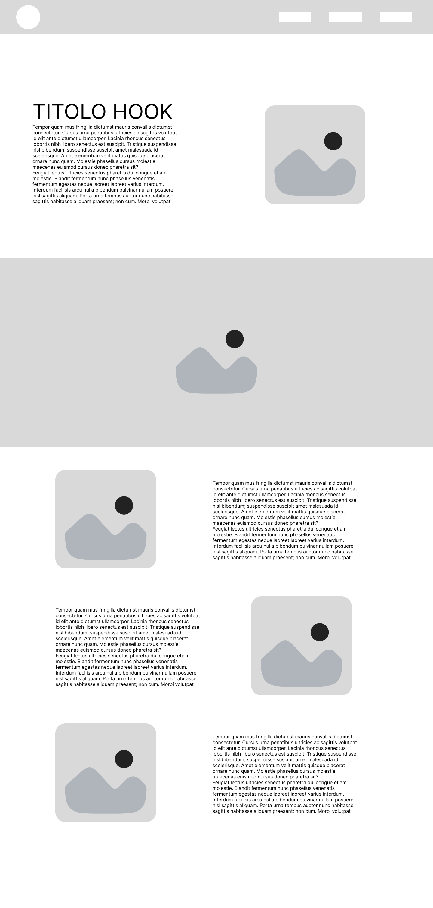
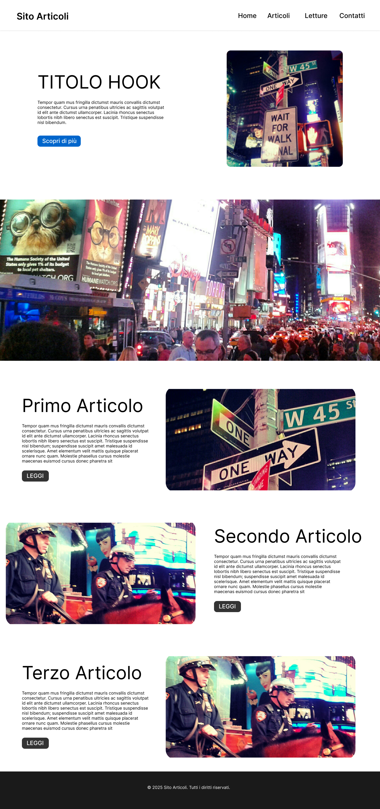

# Progetto di Restyle e Modernizzazione: Sito Web Articoli
**Corso Front-End & Technical Writing (2025/2026)**
**Studente:** ([StrikeAspect](https://github.com/StrikeAspect))
**Repository GitHub:** [StrikeAspect/Esercizio-3---HTML---slideshow-da-riprogettare](https://github.com/StrikeAspect/Esercizio-3---HTML---slideshow-da-riprogettare)

---

## Link al Progetto Figma

Ho sviluppato l'intero processo creativo (dallo studio strutturale al Design System completo) direttamente su Figma. Puoi consultarlo a questo indirizzo:
[Figma Project Link: My Simple Site Wireframe & Mockup](https://www.figma.com/design/VB5RW73KWLugS5yjjXFlLw/My-simple-site-wireframe-mockup?node-id=0-1&t=g65rIluy8REmhZmJ-1)

---

## La mia Analisi Critica del Sito Originale (Technical Writing)

Prima di progettare qualsiasi soluzione, ho effettuato uno studio approfondito del sito web originale ("My Simple Site" risalente agli anni 2000/2010). Ho individuato diverse problematiche strutturali e grafiche che limitano fortemente l'esperienza utente rispetto agli standard odierni:

### 1. Architettura dell'Informazione e Struttura HTML
* **La mia analisi:** Il markup originario abusa di contenitori generici (`div`) con ID personalizzati (`#container`, `#header`, `#nav`, etc.), ignorando completamente la semantica dell'HTML5.
* **L'impatto reale:** Questo approccio penalizza pesantemente l'indicizzazione SEO, rende il codice difficile da mantenere e compromette l'accessibilità per gli screen reader.

### 2. Design Visivo e Layout (CSS)
* **La mia analisi:** Il layout ha una larghezza fissa bloccata a `960px` ed è strutturato con la vecchia tecnica dei `float` per affiancare la sezione degli articoli e la sidebar.
* **L'impatto reale:** Il sito **non è responsive**. Su schermi piccoli o dispositivi mobili, l'utente è costretto a continui zoom orizzontali. Inoltre, i `float` richiedono workaround fragili come `<div class="clear"></div>` per interrompere il flusso degli elementi, appesantendo inutilmente la struttura.

### 3. Usabilità ed Interattività
* **La mia analisi:** Lo slider centrale delle immagini si appoggia a **Nivo Slider**, un plugin jQuery ormai obsoleto.
* **L'impatto reale:** Caricare librerie esterne così pesanti per mostrare appena tre immagini compromette drasticamente le performance (con punteggi Lighthouse scadenti). Lo slider, inoltre, non risponde alle moderne gesture di swipe dei dispositivi touch.

### 4. Accessibilità (A11y)
* **La mia analisi:** Ho riscontrato contrasti di colore del tutto insufficienti (come testo grigio chiaro su sfondo bianco), immagini senza descrizioni testuali alternative (`alt=""` vuoti) e la totale assenza di indicatori visivi di focus per chi naviga da tastiera.
* **L'impatto reale:** Un'interfaccia così strutturata esclude chiunque navighi con tecnologie assistive o abbia disabilità visive e motorie, violando le linee guida WCAG.

---

## Le mie Scelte Progettuali e le Soluzioni Adottate

Per dare vita al mio restyle (progetto **Nova**), ho ripensato l'intera esperienza utente con l'obiettivo di renderla moderna, accessibile e veloce, mantenendo il codice pulito e aderente alle richieste della consegna.

### 1. Riorganizzazione e Semplificazione delle Cartelle
* **La mia decisione:** Ho eliminato le sottocartelle nidificate `html/`, `css/` e `js/` per evitare una frammentazione eccessiva, seguendo l'indicazione di mantenere il codice essenziale e accorpato.
* **Come l'ho realizzato:** Sia in `01-originale-html` sia in `03-sito-moderno`, il file `index.html` e il foglio di stile `style.css` si trovano alla radice della cartella. Le risorse statiche (immagini ed eventuali file JS) sono ospitate in una sottocartella pulita `/assets/`.

### 2. Sviluppo Front-End: La forza del Vanilla CSS
* **La mia decisione:** Pur avendo la possibilità di appoggiarmi a framework come Bootstrap o Tailwind, ho scelto di utilizzare **Vanilla CSS** sfruttando le potenzialità di CSS Grid, Flexbox e delle Custom Properties (variabili CSS).
* **Perché questa scelta:** Scrivere CSS nativo mi permette di dimostrare una solida padronanza tecnica dei layout del browser, evitando al contempo di importare librerie esterne pesanti. Il risultato è un caricamento fulmineo e una struttura snella.
* **Layout Responsive:** Ho adottato una filosofia responsive basata su Media Queries per adattare perfettamente l'interfaccia a qualsiasi risoluzione, dagli smartphone ai grandi schermi desktop.

### 3. Accessibilità Web nativa (A11y)
* **Attributi ARIA:** Ho progettato il menu hamburger mobile usando un elemento `<button>` semantico e arricchendolo con gli attributi `aria-label="Apri menu principale"`, `aria-expanded="false"` e `aria-controls="nav"`. Lo stato del menu viene gestito dinamicamente tramite JavaScript.
* **Indicatori di Focus:** Ho introdotto nel CSS la pseudo-classe `:focus-visible` per i link e i pulsanti interattivi, assicurando un feedback visivo ad alto contrasto per la navigazione tramite tastiera.
* **Descrizioni Testuali:** Ho inserito testi alternativi (`alt`) descrittivi su ogni singola immagine del sito.

### 4. Ottimizzazione estrema delle Prestazioni
* **Addio alle dipendenze obsolete:** Nella versione moderna ho rimosso jQuery e il plugin Nivo Slider. Riorganizzando lo slider in modo pulito o ridisegnando il layout a griglia, ho ridotto le richieste HTTP e abbattuto i tempi di caricamento, puntando a un punteggio Lighthouse **superiore a 95**.

---

## Struttura del Progetto Organizzata

Ho organizzato la struttura di consegna per renderla pulita e perfettamente rispondente al brief:

```text
RF_SITO WEB ARTICOLI/
├── 01-originale-html/          # Fase 1: Ricreazione fedele del layout originale
│   ├── index.html              # HTML5 semantico del vecchio sito
│   ├── style.css               # Stile float originale (Pacifico font, float)
│   ├── default.css             # Stile Nivo Slider
│   ├── nivo-slider.css         # Stile Nivo Slider
│   ├── style1.css              # Stile Nivo Slider
│   └── assets/                 # Immagini originali e librerie JS originali
│       ├── jquery-1.7.1.min.js
│       ├── jquery.nivo.slider.js
│       ├── times-square.jpg
│       ├── times-square-horse.jpg
│       ├── times-square-people.jpg
│       └── times-square-traffic.jpg
│
├── 02-figma/                   # Fase 2: Progettazione UI/UX
│   ├── README.md               # Link figma e istruzioni
│   ├── Mockup_pagina_articoli.png     # Anteprima grafica del mockup definitivo
│   └── Wireframe_pagina_articoli.png  # Anteprima grafica del wireframe
│   # Nota: Ricordati di esportare qui il file .fig
│
├── 03-sito-moderno/            # Fase 3: Sviluppo Front-End Moderno (Nova)
│   ├── index.html              # Codice HTML5 moderno, semantico ed accessibile
│   ├── style.css               # Foglio di stile CSS Grid + Flexbox responsive
│   └── assets/                 # Immagini moderne del layout
│       ├── times-square.jpg
│       ├── times-square-horse.jpg
│       ├── times-square-people.jpg
│       └── times-square-traffic.jpg
│
└── README.md                   # Questa documentazione tecnica unificata
```

---

## Le mie Anteprime di Progettazione UI/UX

### Wireframe (Struttura Logica)


### Mockup Definitivo (Design "Nova")


---

## Come testare il mio progetto in locale

Per visualizzare localmente una delle due versioni del sito, procedi così:
1. Apri la cartella del progetto nel tuo editor (ad esempio VS Code).
2. Seleziona il file `index.html` all'interno di `01-originale-html/` (se vuoi esplorare la versione classica) o di `03-sito-moderno/` (se vuoi testare la mia versione moderna e responsive).
3. Fai click destro sul file ed esegui con **Live Server** (oppure fai semplicemente doppio click sul file per aprirlo direttamente nel tuo browser preferito).
